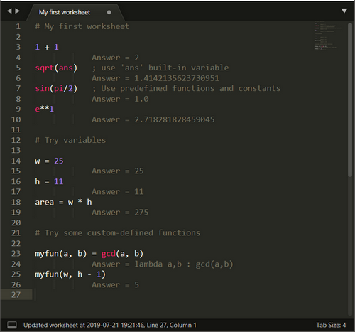

# sublime-calc

This SublimeText3 plugin is inspired by the [SpeQ Mathematics](https://www.speqmath.com/) application.
It transforms your SublimeText editor into a powerful calculator/worksheet.



## How to install and use it

* Put all files under the `$SUBLIME_SETTINGS/Packages/sublime-calc` directory
* Start SublimeText3 editor
* Create a new file
* Set file syntax to **Worksheet**
* Start typing expressions, then press ENTER
* The answer will automatically appear on the next line

## Features

### Basic math

```
1 + 2
      Answer = 3
1/9
			Answer = 0.1111111111111111      
Ans ** 2
			Answer = 0.012345679012345678
pi * 5**2
			Answer = 78.53981633974483    
1e6 + 1e7
			Answer = 11000000.0
```
### Basic complex math
```
1 + 2j
			Answer = (1+2j)
Ans / 2
			Answer = (0.5+1j)
```
### Math functions

All python built-in math functions are supported (see https://docs.python.org/3.6/library/math.html)
```
log10(100)
			Answer = 2.0
sin(pi/2)
			Answer = 1.0
degrees(pi)
			Answer = 180.0
factorial(27)
			Answer = 10888869450418352160768000000
```

### Percent arithmetic
```
100 + 17%
			Answer = 117.0
117 - 17%
			Answer = 97.11
25 * 20%
			Answer = 5.0
			
; 10% of what number will be 1?
1 / 10%
			Answer = 10.0
```

### Rational arithmetic

```
1:2
			Answer = 1/2
Ans +  3:8
			Answer = 7/8
Ans * 2
			Answer = 7/4
; Convert decimal value to rational
::.125
			Answer = 1/8
::3.14159265358979323
			Answer = 3126535/995207
pi -  3126535/995207 
			Answer = 1.1426415369442111e-12
; Back to decimals
1:3 + 1:3**2 + 1:3**3 + 1:3**4
			Answer = 40/81
Ans + 0.0
			Answer = 0.49382716049382713
```

### Date arithmetic
```
date(2019, 1, 1)
			Answer = 2019-01-01
today - ans
			Answer = 228 days, 0:00:00
Ans /4
			Answer = 57 days, 0:00:00
today + 1 year
			Answer = 2020-08-17
today + 1 month
			Answer = 2019-09-17
today + 1 week
			Answer = 2019-08-24
today + 1 day
			Answer = 2019-08-18
today + 24 hour
			Answer = 2019-08-18
```
### Variables

```
radius = 5
			Answer = 5
height = 5
			Answer = 5
volume = pi * radius**2 * height
			Answer = 392.69908169872417
```

### User-defined functions

```
volume(radius, height) = pi * radius**2 * height
			Answer = lambda radius,height : pi*radius**2*height

volume(5, 5)
			Answer = 392.69908169872417

c(n, k) = factorial(n) / (factorial (k) * factorial(n - k))
			Answer = lambda n,k : factorial(n)/(factorial(k)*factorial(n-k))
      
c(10, 5)
			Answer = 252.0
```

It's allowed to use built-in functions inside a custom function definition. Defining custom functions based on another custom functions is not supported.

### Named stacks

A worksheet may contain several named stacks. A named stack starts with the `@` character followed by a stack name. 
All calculations within the stack are collected into an array with the variable name corresponding to the stack name. Elements of this array can be accessed using the `[n]` syntax, or the variable can be passed to a function with an array argument (`sum()` or `prod()`).

First stack element (with index 0) is always the last answer. Second stack element (with index 1) is the previous answer, etc. 

Example:

```
; open a new stack
@mystack
@mystack

var1 = 1
			Answer = 1
var2 = 3.14
			Answer = 3.14
; access stack items: mystack[0] is the last answer, mystack[1] is previous answer
mystack[0] + mystack[1]
			Answer = 4.140000000000001
; previous answer has been put onto the stack too, so `sum()` returns sum of all items previous items
sum(mystack)
			Answer = 8.280000000000001

```

### Anynymous stacks

By default an anonymous stack is created for the entire worksheet.

The `@@` variable references to the entire stack, it can be passed to a function with an array argument, e.g. `sum(@@)` or `prod(@@)`.

It's also possible to access stack elements: 
* `@` references to the last answer
* `@0` references to the last answer stack item, i.e. the last answer
* `@1` references to the 1-st answer stack item
* `@2` references to the 2-nd answer stack item
* `@N` references to the N-th answer stack item

Example:

```
1
			Answer = 1
2
			Answer = 2
3
			Answer = 3
sum(@@)
			Answer = 6
; accessing the 4-th element of the (zero-based) stack
@3
			Answer = 1

```

### Comments

```
; end to line comment

# Heading level 1
## Heading level 2
### Heading level 3
#### Heading level 4
##### Heading level 5
###### Heading level 6
```

Headings allow to navigate quickly through the worksheeet with the *Symbols* popup (`Ctrl + R`).

## Useful shortcuts

* Press F5 to recalculate entire worksheet
* Press F2 to display a list of defined variables
* Start typing a new line with + - * / to automatically use the previous answer
* Use CTRL+/ to comment/uncomment a line
* Comments are also symbols, use CTRL+R to navigate the worksheet
